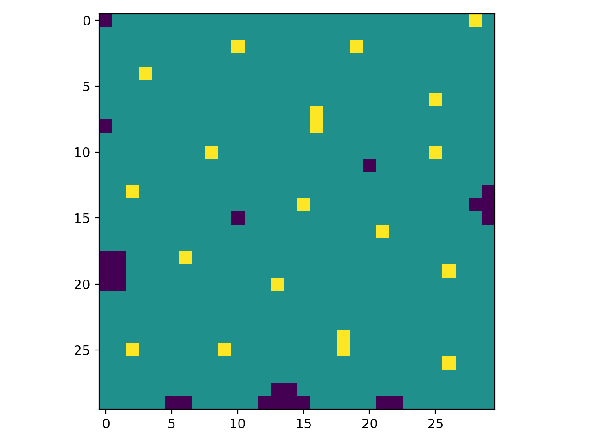

METAHEURISTIQUE - SENSOR PLACEMENT
========================================



Cette implementation offre deux solveurs pour le probleme de placement de capteurs:
- Le recuit simulé (mon choix)
- l'algorihme genetique

On pourra les evaluer avec plusieurs visulisation possible:
- ert ecdf
- convergence au cours des iterations
- heatmap 3D de ert_ecdf

| ert ecdf              | heatmap                       | convergence                   | 
|-----------------------|:----------------------------- |:----------------------------- |
|  |       |                      |


on peut aussi comparer deux solveurs par leur: 
- ert ecdf
- heatmap et zone de domination
- score de auc sur plusieurs target de fonction objectif (une sorte de AUC 3D)

| ert ecdf comparison             | heatmap                       | 
|-----------------------|:----------------------------- |
|  |       | 

score AUC : 
```sh
+-------------+--------+
|   Solver    | Score  |
+=============+========+
| num_recuit  | 97.600 |
+-------------+--------+
| num_genetic | 96.350 |
+-------------+--------+
best solver is num_recuit :97.60
```

Dependances
----------

pour installer il faut juste faire la commande

```sh
pip install -r requirements.txt
```


Single & Multiple Runs
----------

- **Single runs**

    > pour faire un seul run on utilise le script `snp.py` avec l'interface classique du cours. cependant de nouvelles options importantes sont introduites :
    ```sh
    python snp.py -m num_recuit -n 20 -r 0.15 -p config_1 --call 400
    ```
    explication des nouvelles options : 
    
    - -p | --param : designe le fichier de configuration qui va etre utiliser pour initialiser les paramètres du solveur. les configurations se trouvent dans `config/$nom_du_solveur/config_$i.yml`
    - --call : designe le **nombre maximum** d'appel à la fonction objectif 


- **Multiple runs**

    > pour faire plusieurs runs on utilisera plutôt `snp_runs.py` comme suit : 
    ```sh
    python snp_runs.py -m num_recuit --nb-run 5 -r 0.16 -n 20 --param config_1 --call 500 --save
    ```
    explication des nouvelles options :
    - --nb-runs : le nombre de runs que nous souhaitons éffectuant
    - --save :  si on l'ajoute, le script va sauvegarder les valeurs de la fonction objectif. nous sauvegardons dans un fichier `json` dans `saves/$nom_du_solveur.json`. ce fichier contiendra aussi la configuration du solveur ainsi que les données des iterations. ces données nous seront utiles pour l'évaluation

    > pour avoir l'ERT il faudra faire plusieurs runs 


Plots and Evaluation
------------

**Pour vos propres tests effectuez un mutiple runs de num_recuit et num_genetic en sauvergardant
avec l'option --save. vous allez ensuite utiliser leur fichier json. Je vous 
fourni les miennes que j'ai sauvegarder dans** : `saves/mine/`

comme nous l'avons dit plus haut nous offrons plusieurs type de visualisation pour evaluer nos solveurs

notre interface permet d'avoir des visualisations qui permettent d'évaluer un seul solveurs mais aussi d'en comparer deux.


* **PLOTS POUR UN SEUL SOLVEUR**
    - **FULL**
    >nous avons trois élément à présenter : ert_ecd, heat_map, convergence. 
    
    on peut les avoir tous en seul appel avec :
    
    ```sh
    python plots.py --folder saves/mine/ --solvers num_recuit --type single --rep full --target 800
    ```

    explication des nouvelles options :
    - --folder : le dossier où se trouve le fichier json 
    - --solvers : le nom du solveurs à evaluer. il peut aussi en recevoir plusieurs mais cela sera utile plus tard pour la comparaison
    - --type | -t : qui prend les valeurs `single` ou `compare` pour signifier qu'on veut des visualisation pour évaluer un seul solveur ou en comparer deux
    - --rep | -r : qui demande le type de representation qu'on veut avoir. `full` permet de les affichers elles toutes. on a aussi d'autre choix : `ert`, `conv`, `heat`
    - --target : est utile port l'ERT car il nous permet de choisir le seuil

    resultat:
    
    | full              | 
    |-----------------------|
    |  | 

    - **SINGULIER**

    on peut également les afficher seuls : 
    * ert
    ```sh
    python plots.py --folder saves/mine/ --solvers num_recuit --type single --rep ert --target 800
    ```
    * heatmap 
    ```sh
    python plots.py --folder saves/mine/ --solvers num_recuit --type single --rep heat 
    ```
    * convergence
    ```sh
    python plots.py --folder saves/mine/ --solvers num_recuit --type single --rep conv 
    ```
    resultat : 
    
    | ert ecdf              | heatmap                       | convergence                   | 
    |-----------------------|:----------------------------- |:----------------------------- |
    |  |       |                      |

* **PLOTS POUR COMPARER DEUX SOLVEURS**  
    > ici il faudra fournir le nom de deux solveurs. on va comparer leur ERT ou leur zome de domination sur le heatmap 
    
    pour vos propres test, n'oubliez pas de faire les runs de l'autre algo si vous voulez. de toute façon je vous ai les miens
    
    - **ERT**
    ```sh
    python plots.py --folder saves/mine/ -t compare -r ert --solver num_recuit num_genetic --target 850
    ```    
    résultat : 
    
    | comparaison des ERT   | 
    |-----------------------|
    |       | 

    - **HEATMAP DOMINANT**
    ```sh
    python plots.py --folder saves/mine/ -t compare -r heat --solver num_recuit num_genetic
    ```    
    résultat : 
    
    | zone de domination des solveurs   | 
    |-----------------------|
    |       | 


* **QUI EST LE MEILLEUR SOLVEUR ?**  
    > pour répondre à cette question nous allons calculer l'AUC de plusieurs ERT partant d'un seuil facile à des seuils difficiles
    .le cumul des scores sera pour l'indicateur du meilleure solveur. nous allons pour cela utiliser le script `evaluate.py`
    
```sh
python evaluate.py  --folder saves/mine/ --solvers num_recuit num_genetic
```
```
+-------------+--------+
|   Solver    | Score  |
+=============+========+
| num_recuit  | 97.600 |
+-------------+--------+
| num_genetic | 96.350 |
+-------------+--------+
best solver is num_recuit :97.60
```
